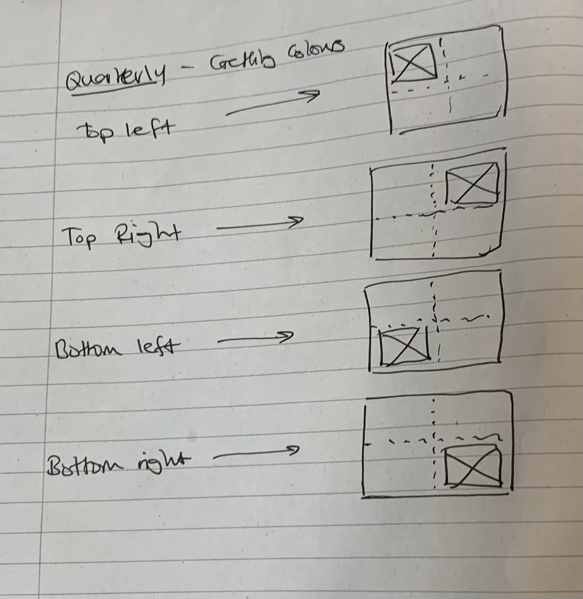

## Hueify

This is the start of the new hue

#### How to Run
To build the frontend and run the server: `./run.sh`

To just run the server: `go run main.go`

#### API reference

https://app.swaggerhub.com/apis/amirrezapanahi/hueify/1.0.0#/developers/NewAlbums

{:height="36px" width="36px"}.

{:height="36px" width="36px"}.
